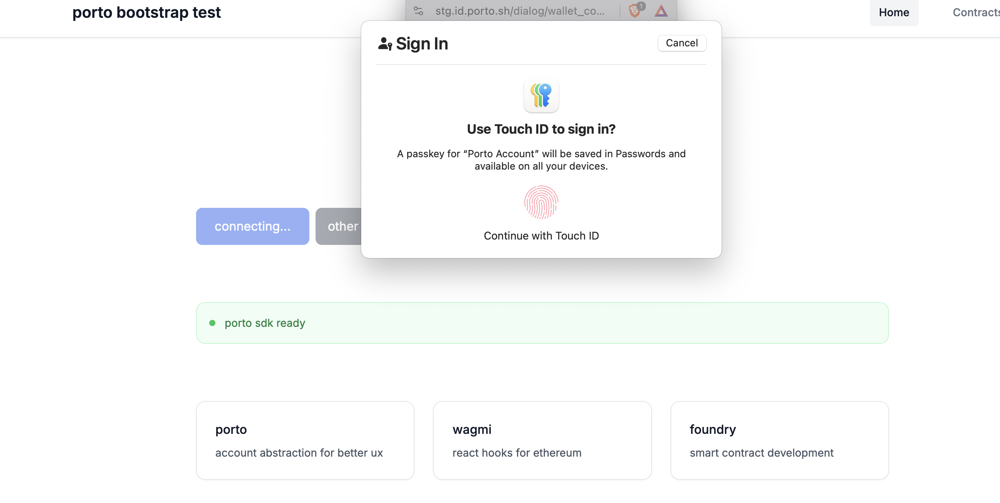

# porto bootstrap test



test boostrapping together a proto foundry stack for pocs 

## Tech Stack

- **Frontend**: Next.js 14, React, TypeScript, Tailwind CSS
- **Web3**: Wagmi, Viem, Porto SDK
- **Smart Contracts**: Solidity, Foundry
- **Package Manager**: pnpm workspaces

## Setup

```bash
pnpm install
pnpm dev:full
```

## Development

Start local blockchain:
```bash
pnpm dev:contracts
```

Deploy contracts:
```bash
pnpm deploy:local
```

Start frontend:
```bash
pnpm dev
```